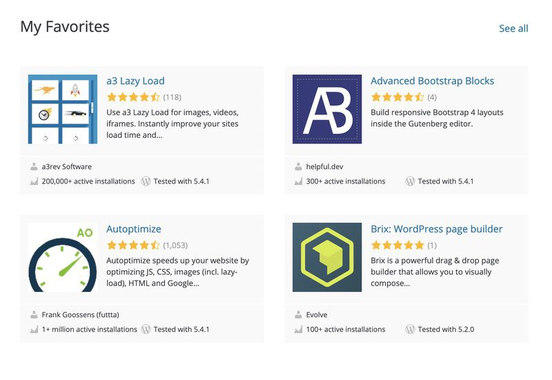
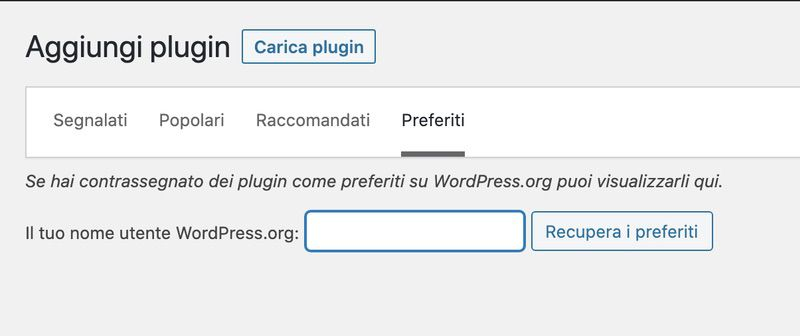

# Meetup Torino - Installa velocemente quello che ti serve e parti subito con WP

| | *14 maggio 2020* - Installa velocemente quello che ti serve e parti subito con WP|
|--|--|

- [Meetup Torino - Installa velocemente quello che ti serve e parti subito con WP](#meetup-torino---installa-velocemente-quello-che-ti-serve-e-parti-subito-con-wp)
  - [Installare WordPress](#installare-wordpress)
    - [Locale](#locale)
    - [Online](#online)
    - [Installare i plugin utilizzati frequentemente](#installare-i-plugin-utilizzati-frequentemente)
      - [VVV Custom Site Template](#vvv-custom-site-template)
      - [I preferiti di wordpress.org](#i-preferiti-di-wordpressorg)
      - [TGM Plugin Activation (TGMPA)](#tgm-plugin-activation-tgmpa)

## Installare WordPress

### Locale

È buona pratica iniziare sempre a lavorare su una installazione locale prima quando parte un nuovo progetto, soprattutto quando prevediamo di mettere mano al codice sando un child theme. Tra i tanti strumenti a disposizione per installare localmente WordPress citiamo i più comuni:

  * [VVV Vagrant](https://github.com/Varying-Vagrant-Vagrants/VVV)
  * [MAMP/LAMP](https://www.mamp.info/en/mac/)
  * [Docker](https://hub.docker.com/_/wordpress/)

### Online
  * [FTP](https://wordpress.org/support/category/installation/)
  * [Installazione automatica](https://wordpress.org/support/article/automated-installation/)
### Installare i plugin utilizzati frequentemente
  * [VVV Custom Site Template](https://github.com/Varying-Vagrant-Vagrants/custom-site-template)
  * [I preferiti su wordpress.org](https://wordpress.org/plugins/browse/favorites/)
  * [TGM Plugin Activation (TGMPA)](https://github.com/TGMPA/TGM-Plugin-Activation)

#### VVV Custom Site Template

#### I preferiti di wordpress.org

Forse non tutti ci fanno caso, ma navigando su wordpress.org usando il proprio account è possibile aggiungere i plugin a una collezione di preferiti, così da ritrovarli più in fretta e facilmente se li utilizziamo di frequente o se li vogliamo per approfondire in seguito perché potrebbero tornarci utili.

Ma perché questo dovrebbe velocizzare il mio lavoro quando inizio un nuovo progetto? Perché nel backend di WordPress dalla pagina di installazione c'è un'utilizzima tab **Preferiti** dalla quale possiamo recuperare tutti i plugin che abbiamo segnalato sul nostro profilo semplicemente inserendo il nostro username e cliccando su *Recupera i preferiti*. 

#### TGM Plugin Activation (TGMPA)

Oppure ti è capitato di installare dei temi e trovarti nella Bacheca di WordPress un messaggio che ti invitava ad installare dei plugin raccomandati. Ecco, anche il tuo child theme potrebbe fare lo stesso ed è molto più semplice di quanto si pensi. Come? Con lo strumento che hanno messo a disposizione [Thomas Griffin](https://github.com/thomasgriffin) ([@jthomasgriffin](https://twitter.com/jthomasgriffin)), [Gary Jones](https://github.com/GaryJones) ([@GaryJ](https://twitter.com/GaryJ)), [Juliette Reinders Folmer](https://github.com/jrfnl) ([@jrf_nl](https://twitter.com/jrf_nl)) chiamato [TGM Plugin Activation](https://github.com/TGMPA/TGM-Plugin-Activation) (per gli amici TGMPA).